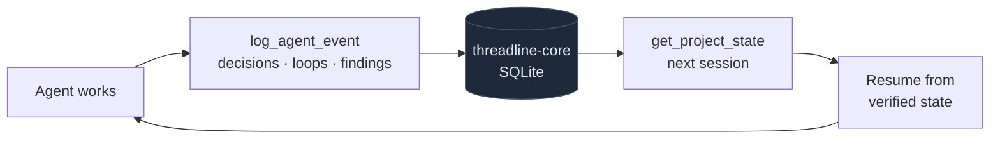
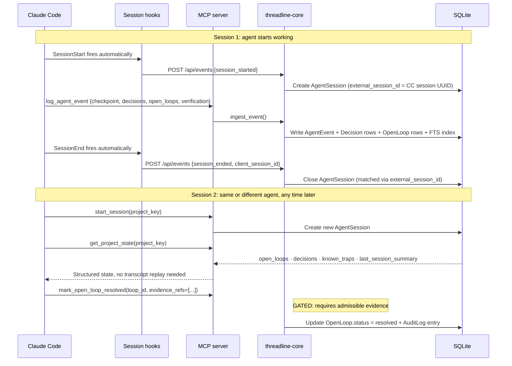
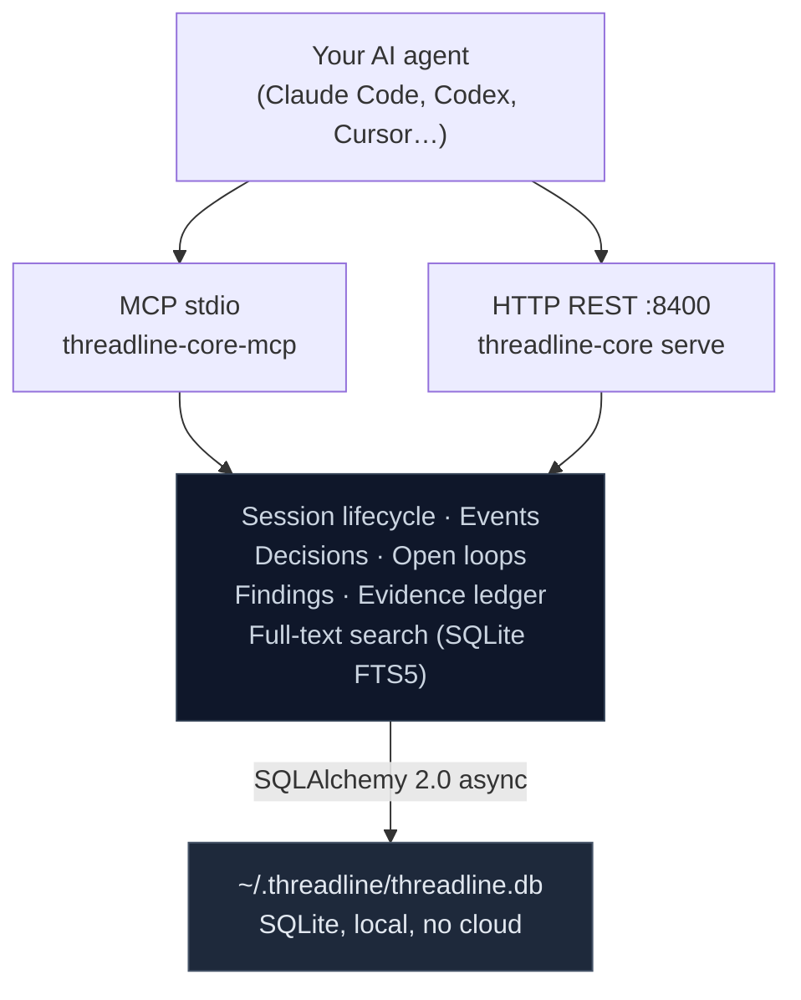

# threadline-core

> Structured continuity memory for AI coding agents: decisions, open loops, and session state in local SQLite, retrieved via MCP.

[](LICENSE)
[](https://python.org)

*Designed with Claude (Fable 5), RIP 🕊️. Threadline v0.1 was started and designed with it.*

---

## The problem

You are three sessions into a complex refactor. The agent lost context. You need it to resume, not replay 8,000 lines of transcript.

Bigger context windows don't solve this. **Capacity isn't memory:** they reload the window, they don't remember what was decided. RAG doesn't solve it either. **RAG returns fragments; threadline-core returns state.**

The agent forgets. The project doesn't.

threadline-core gives agents a structured place to record what they decided, what they left open, and what they verified, then retrieve it instantly in the next session, from any agent or tool.

---

## What makes it different

Most MCP memory servers store and retrieve text. threadline-core tracks **state**:

- **Decisions have outcomes.** Each decision is tracked until an agent marks it `accepted`, `validated`, or `incorrect`. Past mistakes are surfaced as known traps so future agents don't repeat them. The model changes; your decisions don't.
- **Open loops require evidence to close.** An agent cannot mark something done by asserting it. It needs an admissible evidence reference: a verified checkpoint, a confirmed finding, a cited source. A `ValueError` without evidence isn't a bug; it's the gate working.
- **Session continuity, not recall.** `get_project_state` returns structured state (loops, decisions, traps) not a ranked blob of retrieved fragments. Agents get the right signal at session start, not a haystack.
- **No cloud, no LLM, no outbound calls.** The core server runs on SQLite and makes zero network requests beyond its own loopback API. No paywalls. No rate limits. No accounts.

Because it stores structured state rather than raw transcripts, every stored fact is precise, auditable, and stripped of noise. That's not a missing feature; it's the design.

---

## Five-minute installation

**Prerequisites:** Python 3.12+, [uv](https://docs.astral.sh/uv/) (recommended) or pip.

```bash
# Install
pip install threadline-core
# or: uv add threadline-core

# Initialise the local database
threadline-core init
# → Creates ~/.threadline/threadline.db

# (Optional) Start the HTTP API
threadline-core serve
# → Listening on http://127.0.0.1:8400
```

---

## MCP configuration

### Claude Code (`~/.claude/settings.json`)

```json
{
  "mcpServers": {
    "threadline": {
      "command": "threadline-core-mcp",
      "env": {
        "THREADLINE_DATA_DIR": "~/.threadline"
      }
    }
  }
}
```

If you installed with `uv` (not globally):

```json
{
  "mcpServers": {
    "threadline": {
      "command": "uv",
      "args": ["run", "--", "threadline-core-mcp"],
      "env": {
        "THREADLINE_DATA_DIR": "~/.threadline"
      }
    }
  }
}
```

### Other MCP-compatible agents

Run `threadline-core-mcp` directly; it speaks the MCP 2024-11-05 stdio protocol.

---

## Session example

**Session 1.** Agent starts working, records decisions and open loops:

```python
start_session(project_key="auth-refactor")
→ {"session_id": "abc123", "project_key": "auth-refactor"}

log_agent_event(
    event_type="checkpoint",
    project_key="auth-refactor",
    session_id="abc123",
    summary="Extracted token validation logic into middleware",
    details={
        "decisions": ["Move JWT validation to a FastAPI dependency, not inline"],
        "open_loops": ["Rate limiting not yet implemented"],
        "verification": ["pytest tests/test_auth.py (12 passed)"],
    }
)
→ {"decisions_created": 1, "open_loops_created": 1}

end_session(session_id="abc123", summary="Auth middleware extracted. Rate limiting deferred.")
```

**Session 2.** Three days later, any agent resumes from verified state:

```python
start_session(project_key="auth-refactor")

get_project_state(project_key="auth-refactor")
→ {
    "open_loops": [{"description": "Rate limiting not yet implemented"}],
    "decisions":  [{"statement": "Move JWT validation to a FastAPI dependency, not inline",
                    "status": "active"}],
    "known_traps": [],
    "last_session_summary": "Auth middleware extracted. Rate limiting deferred."
  }

# Agent resumes from verified state. No transcript replay needed.
```

---

## The continuity loop



Each transition from loop closed or decision proven wrong is **evidence-gated**: the server rejects self-assertion with a `ValueError`. The loop above only closes when an agent supplies an independently verifiable reference. That's what makes the state trustworthy across model versions, team handoffs, and months of context rot.

---

## Session workflow



---

## Architecture



The server runs entirely on your machine. There are no outbound API calls in threadline-core.

---

## Privacy and local storage

- **All data stays on your machine.** The database defaults to `~/.threadline/threadline.db`. Override with `THREADLINE_DATA_DIR`.
- **No LLM required.** The server indexes, stores, and retrieves without calling any model.
- **No outbound connections.** The package makes no network calls except to its own loopback API.
- **PII minimisation.** Email addresses, phone numbers, and payment card numbers are automatically redacted when stored in decisions, findings, and research notes.
- **API authentication.** Set `THREADLINE_API_TOKEN` to require a bearer token on all REST endpoints. The MCP server uses stdio and is not network-accessible by default.

Your work history is not a product. It stays where you put it.

---

## The 16-tool public API

These tools form the stable public surface, supported across patch and minor versions.

| Tool | Purpose |
|------|---------|
| `start_session` | Open a new agent session for a project |
| `end_session` | Close the session with a summary |
| `log_agent_event` | Ingest a checkpoint, decision, blocker, or note |
| `get_project_state` | Retrieve structured project state |
| `get_open_loops` | List all open (unresolved) loops |
| `mark_open_loop_resolved` | Resolve a loop (requires admissible evidence) |
| `get_decisions` | List active decisions |
| `get_decision` | Get one decision with full detail |
| `mark_decision_outcome` | Record a decision's real-world outcome |
| `get_known_traps` | List decisions proven wrong, with corrected rules |
| `propose_finding` | Propose a gap or caveat |
| `confirm_finding` | Confirm a finding (requires admissible evidence) |
| `resolve_finding` | Mark a finding's resolution condition met |
| `dismiss_finding` | Dismiss a finding as invalid |
| `get_evidence` | Resolve evidence references to their content |
| `search_memory` | Full-text search across all stored memory |

### Evidence-gated transitions

`mark_open_loop_resolved` and `confirm_finding` require an `evidence_refs` list pointing to independently verifiable records in the same project. An agent cannot self-confirm its own findings.

If you receive a `ValueError` from these tools without evidence, that is the gate working correctly, not a bug.

### Experimental

- `search_memory` query semantics may evolve. Current behaviour: path queries (`app/routes/foo.py`) reduce to the basename stem; extensions are stripped. Search results are FTS5 BM25-ranked.

---

## Storage and upgrades

| Item | Detail |
|------|--------|
| Database | `$THREADLINE_DATA_DIR/threadline.db` (default `~/.threadline/`) |
| Initialise | `threadline-core init` |
| Auto-migration | `threadline-core serve` applies additive migrations on startup |
| Patch versions | Schema-compatible, no action needed |
| Minor versions | May add nullable columns; auto-migrated at startup |
| Major versions | May restructure; migration guide in release notes |
| Backup | Copy `threadline.db` (no external state) |

---

## CLI reference

```
threadline-core init         # Initialise data directory and database (idempotent)
threadline-core serve        # Start HTTP API server (default: 127.0.0.1:8400)
threadline-core mcp          # Start MCP server on stdio
threadline-core search       # Full-text search across stored memory
threadline-core export       # Export as static file tree (Obsidian-compatible)
threadline-core progress     # Project momentum: open work, 7-day velocity, sessions
threadline-core connect      # Scaffold agent connectors for existing projects
threadline-core decision     # Decision-quality ledger (operator path)
threadline-core finding      # Findings ledger: confirm/resolve/dismiss (operator path)
threadline-core loop         # Open-loop operator actions
```

---

## Design highlights

| Area | What's notable |
|------|----------------|
| **MCP protocol design** | Full MCP 2024-11-05 stdio server (FastMCP); 16 tools with typed schemas, evidence-gated state transitions, and forward-compatible protocol versioning |
| **AI tooling architecture** | Designed around how agents actually work: session lifecycle, context continuity across sessions, and anti-patterns (self-certification, premature closure) enforced in the service layer |
| **Python async backend** | FastAPI + SQLAlchemy 2.0 async + aiosqlite; clean async/sync boundary with a single-commit ingest pipeline |
| **Protocol design** | `protocol.py` is import-isolated (stdlib + Pydantic only) by design, destined to be extracted as a standalone `threadline-protocol` package; forward-compatibility via `extra="ignore"` throughout |
| **SQLite at depth** | FTS5 virtual table for BM25 search; JSONL evidence log with a defined ordering contract relative to DB commit; ISO-8601 UTC string storage for correct ORDER BY across timezones |
| **CLI tooling** | Rich multi-command CLI (Typer) with sub-apps, operator-path overrides, dry-run flags, and pipe-friendly output |
| **Security engineering** | Evidence-gating that cannot be bypassed via the MCP path; deterministic PII redaction (email, phone, payment card, public IPv4) with Luhn validation; secret-pattern detection (API keys, PATs, PEM, bearer tokens) as a write guard; audit log |
| **Python packaging** | `hatchling` build; console scripts for the CLI, the MCP server, and the packaged Claude Code session hooks; dev group with pytest-asyncio and ruff |

---

## Dogfooded in its own development

Threadline was built while dogfooding Threadline. It was the continuity layer for the project's own development:

- carried open loops across sessions
- preserved decisions, caveats, and unresolved risks
- generated continuation context for the next session
- prevented stale or unsupported state from being treated as complete
- required evidence before any loop was closed

It helped its developer and coding agents continue the project across many sessions without losing deferred work, decisions, or open risks. The continuity layer for its own build, not an autonomous author.

---

## threadline-core vs Threadline

**threadline-core** (this repository, Apache 2.0) is the open substrate:
- MCP server with the 16-tool public API
- HTTP REST API for connector hooks
- Event ingestion and lifecycle (sessions, decisions, loops, findings)
- SQLite persistence and FTS5 search
- Claude Code connector hooks (SessionStart / SessionEnd)
- CLI: `init`, `serve`, `mcp`, `search`, `export`, `progress`, and more

**Threadline** is the full product built on it: the managed, polished experience for people and teams who'd rather not run the moving parts themselves: hosted overnight research, managed connectors, secure multi-device sync, team workspaces, and hands-on setup. Your local Core data and exports are never restricted to push you toward it.

threadline-core has no cloud dependencies, no rate limits, and no paywalls. It is the open foundation, yours to self-host forever.

→ The full Threadline product is in development. ⭐ **Star to follow along.**

---

## Contributing

See [CONTRIBUTING.md](CONTRIBUTING.md).

## Security

See [SECURITY.md](SECURITY.md) to report vulnerabilities privately.

## License

[Apache 2.0](LICENSE)

---

*Designed with Claude (Fable 5) from day one. Threadline v0.1 started with it. RIP, Fable 5. 🕊️*
